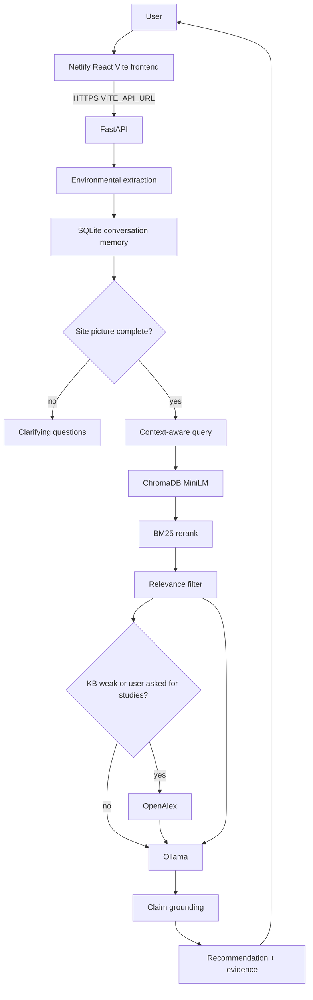

# Aaranya — AI Biodiversity Intelligence


Deployment Link : https://aaranyapp.netlify.app/lab

Repository: https://github.com/AsthaPatil-akp/Aaranya


Aaranya is an evidence-grounded conversational system for land, soil, climate, and biodiversity questions. It behaves like an environmental analyst: it extracts what is known about a site, retrieves passages from a local knowledge base, optionally adds OpenAlex literature, then asks a local LLM to explain only what that evidence supports.

This is not `user question → generic LLM answer`. If the retrieved evidence cannot support a claim, the claim is rewritten or removed before the user sees it.

## Project Overview

Land managers often receive generic chatbot advice that sounds scientific but is not tied to a specific site or to citable passages. Aaranya keeps a site profile in conversation memory, retrieves internal synthesis documents (and optional external abstracts), grounds the model output against those passages, and returns a recommendation with mechanism, impacted metrics, time horizon, confidence, and sources.

**Retrieval and grounding workflow**

1. Extract environmental variables from natural language and optional structured land details.
2. Store and merge them in SQLite conversation memory (`session_id`).
3. Ask clarifying questions when the site picture is too incomplete for a recommendation.
4. Build a context-aware retrieval query.
5. Search ChromaDB (`all-MiniLM-L6-v2`) and rerank with BM25.
6. Drop hits below the relevance threshold.
7. Call OpenAlex only if the knowledge base is weak/missing or the user asked for studies.
8. Send selected evidence to the configured LLM: local Ollama (`llama3.2:3b`) or a hosted Chat Completions API (Groq/OpenAI).
9. Validate claims against retrieved passages; unsupported statements are not shown as facts.
10. Return a grounded answer, recommendation block, and separate internal vs external source lists.

## Links

- GitHub: https://github.com/AsthaPatil-akp/Aaranya
- Live Demo: [ADD AFTER NETLIFY DEPLOYMENT]
- Backend: [ADD AFTER BACKEND DEPLOYMENT]

No public frontend or API URL is claimed here because those hosts are not part of this repository.

## Problem Statement

Biodiversity and land-health advice is easy to hallucinate. A useful assistant must:

- remember the farm or landscape already described
- retrieve passages instead of inventing papers
- separate internal syntheses from external literature
- refuse to present unsupported scientific claims as evidence

## Solution

Aaranya is a FastAPI RAG service plus a React/Vite app. The model is the author of the prose recommendation; the retrieval, filtering, and grounding layers constrain what it is allowed to say. Heuristic scores (soil health, water stress, and similar) are labelled as heuristic readings of the user’s inputs, not validated predictions.

## Key Features

- Intelligence Lab chat with streaming tokens (`/api/chat/stream`)
- Optional Add Land Details form (size, location/map, crop, land use, soil, rainfall, temperature, pesticide use, biodiversity notes)
- Environmental variable extraction and SQLite conversation memory
- Clarifying questions when required variables are missing
- Markdown/PDF ingest → chunk → embed → ChromaDB
- Hybrid retrieval (MiniLM vectors + BM25 + token overlap) with a relevance threshold
- Optional OpenAlex fallback, labelled as external
- Claim-level grounding so unsupported claims are rewritten or dropped
- Recommendation block: action, why it works, impacted metrics, time horizon, confidence, supporting evidence
- Client-side Download Action Plan PDF from the grounded response (no extra backend URL)
- Knowledge Base page with search, upload, and rebuild (upload/rebuild require an admin token)
- Home, Lab, Knowledge, and About routes; first visit lands on Home

## Technology Stack

| Technology | Purpose |
|---|---|
| React 18 + Vite + TypeScript | Frontend SPA |
| FastAPI + Uvicorn | HTTP API and streaming |
| Pydantic Settings | Environment configuration |
| SQLite | Conversation memory and document catalog |
| ChromaDB | Persistent vector store |
| sentence-transformers `all-MiniLM-L6-v2` | 384-d embeddings |
| rank-bm25 | Lexical rerank of Chroma hits |
| Ollama (`llama3.2:3b` default) | Local LLM |
| Groq / OpenAI Chat Completions | Hosted LLM for Render production |
| OpenAlex (optional) | External literature lookup |
| Nominatim | Optional place search for the map |
| jsPDF | Client-side action-plan PDF |
| Leaflet | Land-details map |
| Docker Compose | Production-style API + Ollama |
| Netlify | Static frontend host only |
| pytest + Vitest | Backend and frontend tests |

## Architecture



Local development skips Netlify: Vite on port 5173 proxies `/api` to FastAPI on port 8000.

Production target:

```
USER → Netlify (React) → HTTPS → public FastAPI → Docker
  ├── FastAPI
  ├── Ollama
  ├── ChromaDB
  ├── SQLite
  └── knowledge base
```

Netlify does not run FastAPI, Ollama, SQLite, or ChromaDB.

## RAG Pipeline

1. **Knowledge sources** — eight committed Markdown syntheses in `knowledge/sources/` plus optional uploaded PDF/MD/TXT.
2. **Ingest** — `knowledge_store` reads files, records metadata from `knowledge/manifest.json`.
3. **PDF/Markdown processing** — PDFs keep printer page numbers; Markdown pages are stored with `page_is_real=false`.
4. **Chunking** — configurable `CHUNK_SIZE` / `CHUNK_OVERLAP` (defaults 900 / 140).
5. **Embeddings** — `sentence-transformers` MiniLM, 384 dimensions.
6. **ChromaDB** — collection `darukaa_knowledge` (configurable), cosine space.
7. **BM25** — applied to Chroma candidate hits, not the whole corpus.
8. **Hybrid score** — about 70% vector similarity, 20% BM25, 10% token overlap.
9. **Relevance filter** — default `RELEVANCE_THRESHOLD=0.42`; weak hits are not treated as evidence.
10. **OpenAlex** — used when the KB is weak/missing or the user asked for studies; abstracts or optional OA text.
11. **LLM context** — selected internal and external passages are placed in the prompt with origin labels.
12. **Claim grounding** — draft answer is checked against used evidence; unsupported claims are rewritten or removed.
13. **Final response** — user-facing answer, recommendation block, `kb_evidence`, `external_evidence`.

Internal files are **original Darukaa/Aaranya syntheses** grounded in public institutional science (FAO, IPBES, IPCC, USDA NRCS, CBD). They are not copies of those institutions’ publications. External OpenAlex rows are labelled separately.

## Environmental Knowledge

Variables actually modelled in `EnvironmentalContext` / `StructuredInput`:

- Location: region, location, farm size, latitude, longitude
- Soil: pH, organic carbon (value or label), moisture
- Land: land use, land cover, crop, fragmentation, intercropping
- Biodiversity: species richness, habitat / plant / pollinator / microbial diversity, species survival, observations
- Climate: temperature, rainfall, drought, water availability, climate stress
- Human impact: pollution, pesticide use, deforestation, land degradation, habitat destruction

The land-details UI currently collects a subset: farm size, location/map, crop, land use, soil pH, organic carbon, moisture, rainfall, temperature, pesticide use, biodiversity notes. Other variables can still arrive from chat text.

Seed document topics: soil organic carbon and below-ground biodiversity; rainfall/drought and species survival; monoculture vs agroforestry; cover crops and semi-arid water; pollution and urban species richness; temperature/drought vegetation stress; deforestation and fragmentation; land-use change.

## Conversational Intelligence

- Each chat has a `session_id`. Context JSON and recent messages live in SQLite.
- Follow-ups reuse the same session; the last `history_window` messages (default 6) are available to the pipeline.
- If required variables are missing, mode is `clarification` and the API returns targeted questions (soil carbon, rainfall, land use, crop, moisture, pH, pollution, fragmentation, drought, depending on what is already known).
- Structured land details merge with the message; empty fields stay unknown and are not invented.

## Evidence-backed Recommendations

`RecommendationBlock` includes:

- `action`
- `why_it_works` (mechanism)
- `environmental_relationships`
- `impacted_metrics` (`name`, `direction`, optional `note`)
- `time_horizon` (short / medium / long / narrative, plus `evidence_supported`)
- `confidence` (`high` / `medium` / `low`) and `confidence_rationale`
- `items[]` for per-action why / metrics / horizon / supporting evidence titles
- `supporting_evidence`

The Lab recommendation panel maps those fields. Values are not invented in the UI; missing fields stay empty.

## Multi-Metric Reasoning

The pipeline requires material combinations (for example soil carbon × rainfall × land use) before it treats a recommendation as site-specific. A typical Lab path: low soil organic carbon, low rainfall, and wheat monoculture in a semi-arid setting → cover-crop / residue / water-holding discussion grounded in the cover-crop and soil-carbon syntheses, with metrics such as soil organic carbon and moisture rather than unrelated source titles.

## Input Format

Natural language:

```json
{
  "message": "Biodiversity is declining on my farm.",
  "session_id": null,
  "debug": false
}
```

Structured land details (optional; empty fields omitted):

```json
{
  "message": "Biodiversity is declining on my farm.",
  "session_id": null,
  "structured": {
    "farm_size": "5 acres",
    "location": "Pune, India",
    "latitude": 18.52,
    "longitude": 73.85,
    "crop": "wheat",
    "land_use": "monoculture",
    "soil_ph": 8.1,
    "soil_organic_carbon": 0.3,
    "soil_moisture": "low",
    "rainfall": "low"
  }
}
```

`structured_json` is an alternative string form of the same object.

## Output Format

Successful recommendation responses include (fields may be empty when not grounded):

```json
{
  "session_id": "…",
  "mode": "recommendation",
  "assistant_message": "…grounded prose…",
  "clarifying_questions": [],
  "known_variables": { "soil_organic_carbon": 0.3, "rainfall": "low" },
  "recommendation": {
    "action": "…",
    "why_it_works": "…",
    "impacted_metrics": [{ "name": "soil organic carbon", "direction": "up" }],
    "time_horizon": { "short_term": "…", "evidence_supported": true },
    "confidence": "medium",
    "supporting_evidence": ["Cover Crops, Residue Retention and Water-Holding Capacity in Semi-Arid Farming"]
  },
  "kb_evidence": [],
  "external_evidence": [],
  "knowledge_status": "grounded_in_knowledge_base",
  "warnings": []
}
```

Clarification mode returns `mode: "clarification"` and questions instead of a recommendation. Insufficient evidence returns a refusal to fabricate papers rather than invented citations.

## Scientific Evidence

- **Internal** — `origin=knowledge_base`, shown as knowledge-base sources.
- **External** — OpenAlex rows, shown as external scientific sources.
- OpenAlex is optional (`ENABLE_OPENALEX`). It is not a substitute for the local KB.
- Grounding drops or rewrites claims that are not supported by the passages actually sent to the model.
- The system does not invent paper titles, DOIs, or institutional reports.

## Project Structure

```
Aaranya/
  backend/app/          FastAPI app, config, routes, RAG services
  frontend/             React + Vite UI
  knowledge/sources/    Seed Markdown syntheses
  knowledge/manifest.json
  tests/                pytest suite (Ollama mocked unless live flag set)
  scripts/              API start, ingest helpers
  docker/               Ollama entrypoint
  docs/                 Architecture, database, knowledge, deployment notes
  Dockerfile
  docker-compose.yml
  netlify.toml
  .env.example
```

Not in GitHub: `.env`, `.venv`, `node_modules`, `data/` (SQLite + Chroma runtime), Ollama model files, `docs/SUBMISSION_DRAFT.docx`.

## Database / Schema

**SQLite** (path `SQLITE_PATH` or `DATA_DIR/darukaa.sqlite`)

| Table | Role |
|---|---|
| `conversations` | `id`, timestamps, `context_json` (environmental profile) |
| `messages` | `session_id`, role, content, timestamp |
| `documents` | catalog: name, source, type, topic, pages, checksum, title/authors/DOI/URL |
| `chunks` | text chunks with page metadata |

Sessions are isolated by `session_id`.

**ChromaDB** (`CHROMA_PATH`, collection `CHROMA_COLLECTION`)

Each vector is one chunk with metadata: document name, source, page, `page_is_real`, topic, type, checksum, title, authors, URL/DOI, year, origin.

SQLite and Chroma are **single-instance**. Do not run multiple API replicas against separate empty volumes and expect shared memory or a shared index.

## Local Setup

Python 3.11+ and Node 20 are recommended.

### 1. Ollama (required for live chat)

Windows: install from https://ollama.com/download then:

```powershell
ollama serve
ollama pull llama3.2:3b
```

macOS / Linux:

```bash
ollama serve
ollama pull llama3.2:3b
```

The API talks to `OLLAMA_BASE_URL` (default `http://localhost:11434`). Chat returns an error if Ollama is down; it does not invent an answer.

### 2. Backend

```powershell
python -m venv .venv
.venv\Scripts\activate
pip install -r backend/requirements.txt
copy .env.example .env
```

macOS / Linux:

```bash
python -m venv .venv
source .venv/bin/activate
pip install -r backend/requirements.txt
cp .env.example .env
```

Edit `.env`: set `ADMIN_API_TOKEN` to a private local token (not the placeholder). Keep `OLLAMA_BASE_URL=http://localhost:11434` for local Ollama.

```powershell
cd backend
uvicorn app.main:app --reload --host 0.0.0.0 --port 8000
```

Health: http://127.0.0.1:8000/api/health  
Liveness: http://127.0.0.1:8000/health

Confirm `llm_available=true` only when Ollama and the model are reachable.

### 3. Frontend

Do **not** copy `frontend/.env.example` for local work. With `VITE_API_URL` unset, Vite proxies `/api` to `http://127.0.0.1:8000`.

```powershell
cd frontend
npm install
npm run dev
```

Open http://127.0.0.1:5173

### 4. Tests

```powershell
.venv\Scripts\activate
python -m pytest -q
cd frontend
npm test
npm run build
```

Unit tests mock Ollama. Optional live check:

```powershell
$env:RUN_OLLAMA_INTEGRATION="1"
pytest -q tests/test_ollama.py::test_live_ollama_optional
```

## Environment Variables

Copy `.env.example` → `.env`. Never commit `.env`.

Placeholders only:

| Variable | Role |
|---|---|
| `APP_ENV` | `development` / `production` / `test` |
| `API_HOST` / `API_PORT` | Bind address; cloud `PORT` wins if set |
| `LLM_PROVIDER` | `ollama` locally; `groq` on Render |
| `OLLAMA_BASE_URL` | Local `http://localhost:11434` |
| `OLLAMA_MODEL` | Default `llama3.2:3b` |
| `GROQ_API_KEY` | Backend-only hosted key (never `VITE_`) |
| `GROQ_MODEL` | Default `llama-3.1-8b-instant` |
| `OPENAI_API_KEY` | Optional paid hosted provider |
| `DATA_DIR` / `SQLITE_PATH` / `CHROMA_PATH` | Runtime stores |
| `RETRIEVAL_BACKEND` | `hybrid` locally (MiniLM+Chroma); `bm25` on Render Free |
| `KNOWLEDGE_DIR` / `SOURCE_DIR` / `PDF_DIR` | Knowledge files |
| `ADMIN_API_TOKEN` | `your-long-random-admin-token-here` |
| `CORS_ORIGINS` | Comma-separated browser origins |
| `FRONTEND_ORIGIN` | Extra allowed origin (Netlify site) |
| `VITE_API_URL` | Frontend build-time API origin (Netlify only) |

Do not put `ADMIN_API_TOKEN` or provider keys in any `VITE_` variable. `VITE_` values are baked into the browser bundle.

## API Documentation

| Method | Route | Auth | Purpose |
|---|---|---|---|
| GET | `/health` | none | Process liveness `{"status":"ok"}` |
| GET | `/api/health` | none | Stack health: embeddings, Chroma counts, LLM flags |
| POST | `/api/chat` | none | Full pipeline JSON response |
| POST | `/api/chat/stream` | none | NDJSON stream: `token` / `final` / `error` |
| GET | `/api/geocode?q=` | none | Nominatim place search for the map |
| POST | `/api/analyze` | none | Same as chat with `debug=true` |
| GET | `/api/conversation/{session_id}` | `X-Admin-Token` | Memory + history |
| GET | `/api/knowledge` | none | Document list |
| POST | `/api/knowledge/search` | none | Raw retrieval (`{query}`) |
| POST | `/api/knowledge/ingest` | `X-Admin-Token` | Upload PDF/MD/TXT or ingest directories |
| POST | `/api/knowledge/rebuild` | `X-Admin-Token` | Rebuild vectors |

Chat body: `{ message, session_id?, structured?, structured_json?, debug? }`.  
Stream events: `{ "type": "token", "text": "…" }` then `{ "type": "final", "response": {…ChatResponse} }`.

Admin endpoints return 401 if `ADMIN_API_TOKEN` is unset or the header does not match. Do not send that token from Netlify env vars.

## Netlify Deployment

Netlify hosts **only** the React app.

| Setting | Value |
|---|---|
| Base directory | `frontend` |
| Build command | `npm run build` |
| Publish directory | `dist` |
| Redirects | `/*` → `/index.html` `200` (`netlify.toml`) |

Environment variable (build-time):

```
VITE_API_URL=https://YOUR-BACKEND-URL
```

No trailing slash. Rebuild after changing it.

Do **not** add to Netlify: `ADMIN_API_TOKEN`, `OLLAMA_*`, `OPENAI_API_KEY`, `GROQ_API_KEY`, `ANTHROPIC_API_KEY`.

Chat on the live site will fail until FastAPI is hosted elsewhere and this variable points at that origin.

## Backend Deployment

Local live chat uses Ollama. Render Free cannot run Ollama. Production uses the same FastAPI RAG pipeline with `LLM_PROVIDER=groq` (or `openai`).

### Render Free Web Service

1. Create a Web Service from https://github.com/AsthaPatil-akp/Aaranya (`render.yaml` is in the repo).
2. Root directory: repository root.
3. Build: `pip install -r backend/requirements.txt`
4. Start: `uvicorn app.main:app --host 0.0.0.0 --port $PORT`
5. Set `PYTHONPATH=backend`.
6. Set backend env vars (see below). Put `GROQ_API_KEY` only on Render, never in Netlify/`VITE_*`. Production must set `RETRIEVAL_BACKEND=bm25` so MiniLM and Chroma are not loaded.
7. After the first deploy, copy the `https://….onrender.com` origin into Netlify `VITE_API_URL` and redeploy the frontend.

`GET https://YOUR-RENDER-URL/health` should return `{"status":"ok"}`.  
`GET https://YOUR-RENDER-URL/api/health` should show `llm_provider=groq`, `vector_database=bm25`, and `llm_available=true` when the Groq key is set.

Render Free sleeps after idle time and has an ephemeral disk (SQLite knowledge chunks rebuild on boot from `knowledge/`). Local development still uses MiniLM+Chroma when `RETRIEVAL_BACKEND=hybrid`.

Optional Docker Compose on a machine you already own still runs FastAPI + Ollama together. It is not required for the Netlify + Render path.

This repository does **not** include a live backend URL until you create the Render service.

## CORS

Set the exact Netlify origin (no trailing slash):

```
FRONTEND_ORIGIN=https://YOUR-NETLIFY-SITE.netlify.app
CORS_ORIGINS=https://YOUR-NETLIFY-SITE.netlify.app,http://127.0.0.1:5173,http://localhost:5173
```

Production does not allow `*` and does not enable a Netlify regex unless you set `CORS_ORIGIN_REGEX`. Custom domains must be listed explicitly. Restart the API after changing CORS.

## Testing

```powershell
python -m pytest -q
cd frontend
npm test
npm run build
docker compose config
```

`docker compose build` is optional and downloads a large image (PyTorch + MiniLM).

## Demo Script

1. Open Home, then Intelligence Lab.
2. Send: `Biodiversity is declining on my farm.`
3. Confirm clarifying questions (soil carbon, rainfall, land use, …).
4. Open Add Land Details; fill only known fields (for example 5 acres, wheat, monoculture, SOC 0.3%, pH 8.1, low rainfall). Empty fields stay empty.
5. Confirm known variables in the response.
6. Read the grounded answer, recommendation, metrics, time horizon, and confidence.
7. Check Knowledge base sources vs External scientific sources.
8. Ask `What should I do?` and confirm the session still knows the farm.
9. Ask an out-of-corpus question (for example orbital mechanics of an exoplanet vs hadal genomes). Confirm insufficient evidence rather than a fabricated paper.
10. Optionally download the action-plan PDF from that turn.

## Security

- Secrets live in `.env` (gitignored). `.env.example` has placeholders only.
- Frontend `VITE_API_URL` is a public API origin, not a key.
- Admin ingest/rebuild/conversation lookup require `X-Admin-Token`.
- CORS is an allow-list of origins.
- Runtime SQLite, Chroma, and Ollama weights are not committed.
- Health and chat responses do not return API keys.

## Limitations

- Seed knowledge is eight short syntheses, not a full literature library.
- OpenAlex usually contributes abstracts, not full papers.
- `llama3.2:3b` is small; answers depend heavily on retrieved passages and grounding.
- SQLite + Chroma are single-instance; this stack is not horizontally scaled.
- Render Free cannot run Ollama; production chat uses Groq (or OpenAI) via `LLM_PROVIDER`.
- Render Free uses `RETRIEVAL_BACKEND=bm25` (keyword retrieval over the same knowledge chunks) instead of MiniLM+Chroma, because 512 MB RAM cannot load sentence-transformers.
- Nominatim geocoding needs outbound HTTP and is rate-limited.
- No live Netlify or backend URL is included in this repo.
- Uploaded PDFs persist in Docker only because `PDF_DIR=/data/pdfs` is on the data volume; seed Markdown stays in the image.

## Future Improvements

- Host the API on a VM and wire Netlify `VITE_API_URL`
- Expand the knowledge base with licensed PDFs
- GPU Ollama or a hosted LLM for faster public demos
- Stronger evals on grounding precision
- A shared Postgres store if more than one API replica is required

## Hackathon Requirement Mapping

| Requirement | Status | Aaranya implementation |
|---|---|---|
| Retrievable knowledge system | IMPLEMENTED | Markdown/PDF ingest, SQLite catalog, Chroma collection |
| RAG / embeddings / vector DB | IMPLEMENTED | MiniLM + Chroma + BM25 hybrid retrieval |
| Soil health | IMPLEMENTED | pH, organic carbon, moisture; soil synthesis docs |
| Land use / land cover | IMPLEMENTED | land_use, land_cover, crop, fragmentation, intercropping |
| Biodiversity indicators | IMPLEMENTED | richness, habitat/plant/pollinator/microbial diversity, survival |
| Climate factors | IMPLEMENTED | temperature, rainfall, drought, water availability, climate stress |
| Human impact | IMPLEMENTED | pollution, pesticide use, deforestation, degradation, habitat destruction |
| Conversation memory | IMPLEMENTED | SQLite `conversations` + `messages` by `session_id` |
| Clarifying questions | IMPLEMENTED | `needs_clarification` / `clarifying_questions` |
| Evidence-backed recommendations | IMPLEMENTED | Grounded `RecommendationBlock` + source lists |
| Multi-variable reasoning | IMPLEMENTED | Combined soil × water × land-use (and related) context |
| Text input | IMPLEMENTED | Chat message |
| Structured input | IMPLEMENTED | `structured` / `structured_json` + land-details form |
| Recommendation | IMPLEMENTED | action + why_it_works |
| Impacted metrics | IMPLEMENTED | `impacted_metrics[]` |
| Time horizon | IMPLEMENTED | short/medium/long + narrative |
| Confidence | IMPLEMENTED | high/medium/low + rationale |
| Live public demo | NOT IMPLEMENTED | Requires Netlify + hosted API after this repo is deployed |

## License

Prototype code is provided for the Darukaa.Earth challenge. Seed knowledge reports are original educational syntheses; cited institutions retain their own rights in their publications.
