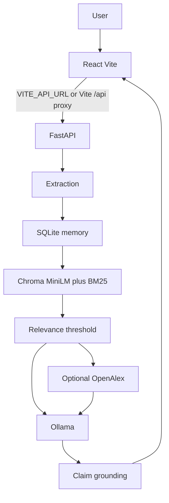

# Architecture

Aaranya is a hybrid scientific assistant: internal RAG over ChromaDB, optional OpenAlex evidence, then an LLM that must stay within retrieved passages.

Default LLM is local Ollama (`llama3.2:3b`). OpenAI/Groq/Anthropic remain optional via `LLM_PROVIDER` and the matching key. The rule engine may propose candidate interventions; the model authors the user-facing recommendation after grounding.

Production split:

- Netlify serves the static React build only.
- A Docker host runs FastAPI, Ollama, ChromaDB, SQLite, and the knowledge files.
- `FRONTEND_ORIGIN` / `CORS_ORIGINS` must include the Netlify origin.
- `VITE_API_URL` is the public FastAPI origin, baked in at Netlify build time.

Internal syntheses are labelled as Darukaa/Aaranya syntheses. They are not original FAO/IPBES/IPCC publications.

SQLite and Chroma are single-process stores. One API replica per data volume.
